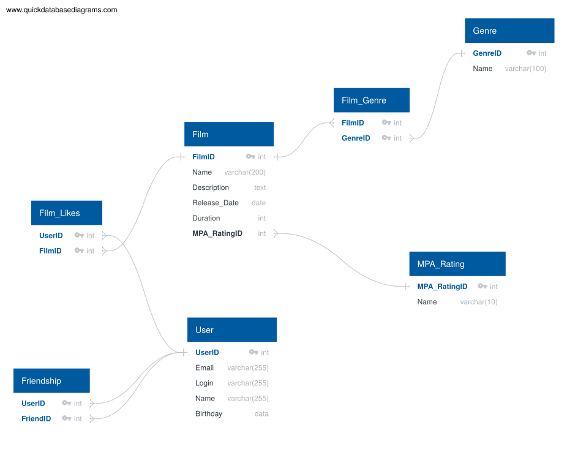

# Filmorate

REST API для сервиса по оценке фильмов. Учебный проект.

## Стек
- Java 21
- Spring Boot 3.2.2
- Lombok
- Maven
- JUnit 5
- SLF4J + Logback

## Функциональность
- Создание, обновление, получение и удаление пользователей и фильмов
- Валидация данных с кастомными исключениями
- Глобальная обработка ошибок через @ControllerAdvice
- Unit-тесты для контроллеров


## Схема базы данных



### Описание схемы

Схема состоит из 7 таблиц:

- **users** — хранит данные пользователей (email, логин, имя, дата рождения)
- **films** — хранит данные фильмов (название, описание, дата релиза, продолжительность)
- **mpa_ratings** — справочник возрастных рейтингов (G, PG, PG-13, R, NC-17)
- **genres** — справочник жанров (Комедия, Драма, Боевик и т.д.)
- **film_genre** — связующая таблица для связи фильмов и жанров (многие ко многим)
- **film_likes** — хранит лайки пользователей на фильмы
- **friendship** — хранит подписки пользователей друг на друга (односторонние)

### Примеры запросов

**Получить все фильмы с их жанрами:**

SELECT f.*, g.name AS genre_name
FROM films f
LEFT JOIN film_genre fg ON f.film_id = fg.film_id
LEFT JOIN genres g ON fg.genre_id = g.genre_id;

**Получить топ-10 самых популярных фильмов по количеству лайков:**

SELECT f.*, COUNT(fl.user_id) AS likes_count
FROM films f
LEFT JOIN film_likes fl ON f.film_id = fl.film_id
GROUP BY f.film_id
ORDER BY likes_count DESC
LIMIT 10;

## Запуск
```bash
mvn clean package
java -jar target/filmorate-*.jar


